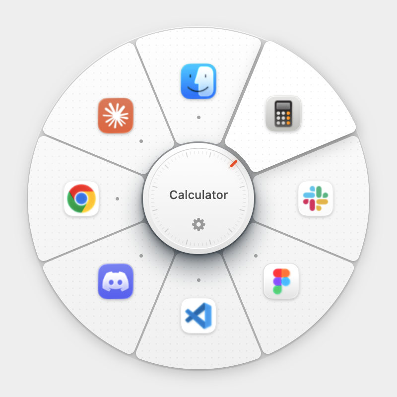

<div align="center">


# Tool Wheel

**A tactile radial launcher for macOS and Windows.**<br>
Hold a shortcut, and your favourite apps fan out around the cursor on a clicky dial.

[](https://github.com/ni3ra5/tool-wheel/releases)


[**⬇ Download from Releases**](https://github.com/ni3ra5/tool-wheel/releases)

<br>



</div>

---

## ✨ Features

- **Opens where you are** – hold the shortcut and the wheel appears around your cursor, on any screen.
- **Feels physical** – molded-plastic slices and a knob that turns in clicky 10° detents with a soft, heavy *thock*.
- **Two ways to open** – click a tool, or just hover and let go of the shortcut.
- **Shows what's running** – a small dot marks apps that are already open.
- **No permissions needed** – no accessibility prompts or keyboard hooks. (Only a mouse side button as the shortcut asks for Accessibility on a Mac, so its Back/Forward can be blocked.)

## 📦 Install

### macOS

> Requires macOS 14 or later (Apple silicon or Intel).

1. Download `ToolWheel-<version>.zip` from [Releases](https://github.com/ni3ra5/tool-wheel/releases) and unzip it.
2. Drag **Tool Wheel.app** into **Applications**.
3. Open it. The app isn't notarized by Apple, so macOS blocks the first launch: go to **System Settings → Privacy & Security**, scroll down and click **Open Anyway**. Or run:
   ```bash
   xattr -dr com.apple.quarantine "/Applications/Tool Wheel.app"
   ```
4. Settings opens on first launch. Open the app again any time to get back to it.

### Windows (preview)

> Windows 10 or 11, x64 or ARM64. Early version: the wheel works; the Settings window is still Mac-only.

1. Download `ToolWheel-<version>-win-x64.zip` (or `win-arm64`) from [Releases](https://github.com/ni3ra5/tool-wheel/releases) and unzip it. Nothing else to install.
2. Run **ToolWheel.exe**. If SmartScreen warns about an unrecognised app, choose **More info → Run anyway**.
3. It lives in the system tray: right-click the icon to **edit tools**, turn on **open at login**, or quit.

## 🎛 Using it

| Do this | macOS | Windows |
| --- | --- | --- |
| Open the wheel around the cursor | Hold **⌃⌥⌘** | Hold **Ctrl+Alt+Win** |
| Open an app | Hover its slice, then click (or release the keys) | same |
| Settings | Click ⚙︎ on the knob | Click ⚙︎ on the knob, or the tray icon |
| Close the wheel | Let go of the keys anywhere else | same |
| Turn the wheel off / on | Your on/off shortcut, if you set one in Settings | same |

## ⚙️ Settings

The Settings window lets you:

- **add apps** by searching everything installed,
- **rearrange** them with the grip beside each slice, or **remove** one by holding its trash,
- **colour-code** a slot with a band along its outer edge (8 preset colours),
- **change the shortcut** (two or more of ⌃ ⌥ ⇧ ⌘, or a mouse side button on its own or with keys), or restore the default,
- set a **shortcut that turns the wheel off and on** (e.g. ⌃⌥P; none by default),
- choose to **open apps by** clicking or by releasing the shortcut,
- **open at login**.

Everything is saved to a `tools.json` (`~/.config/toolwheel/` on macOS, `%APPDATA%\ToolWheel\` on Windows):

```json
{
  "wheel": [{ "name": "Safari", "path": "/Applications/Safari.app", "color": "#0A84FF" }],
  "releaseToOpen": false
}
```

`path` is usually an app (`.app` on macOS; `.exe` or `.lnk` on Windows, where `%WINDIR%`-style variables work), but a file, folder or URL works too.

## 🛠 Build from source

```
mac/        Swift / SwiftUI app
windows/    C# / WPF app (.NET 8)
assets/     icon and screenshot shared by both
```

**macOS**

```bash
cd mac
swift run                      # run a debug build
scripts/build-app.sh 0.4.0     # make dist/Tool Wheel.app and a zip
scripts/make-icon.sh           # re-render the icon for both platforms
```

**Windows**

```bash
cd windows
dotnet run
```

**Releasing:** push a tag and GitHub Actions builds and attaches the downloads – `mac-v0.4.0` for the Mac app, `windows-v0.1.0` for the Windows app.
